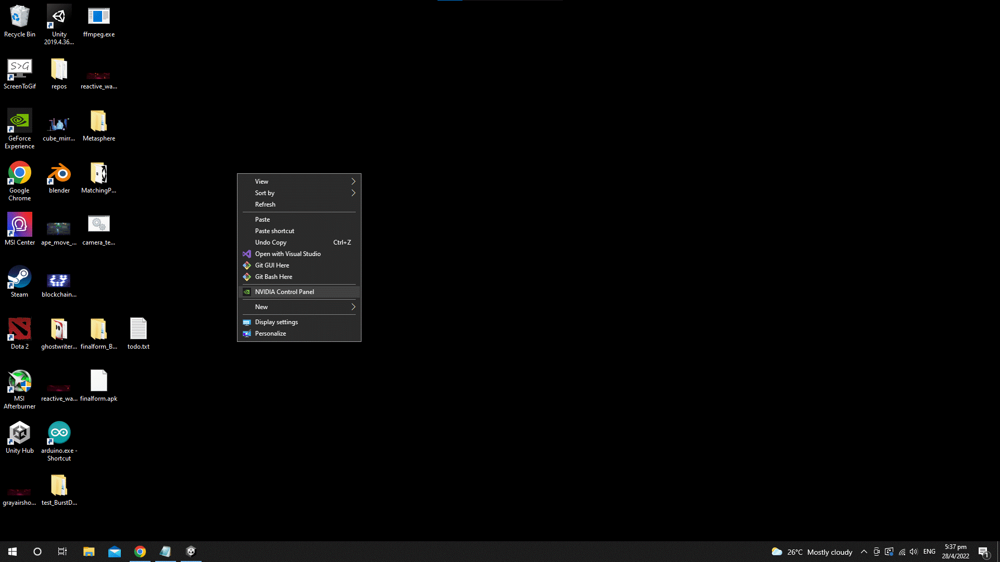

# How to setup multiscreen

1. Right click on Desktop and select NVIDIA Control Panel 
2. Under Configure Surround, PhysX, check 'Span displays with Surround' then select Configure 
3. Move displays to the correct layout. Make sure resolution is at least 2k for both displays and refresh rate >=30 fps. 
