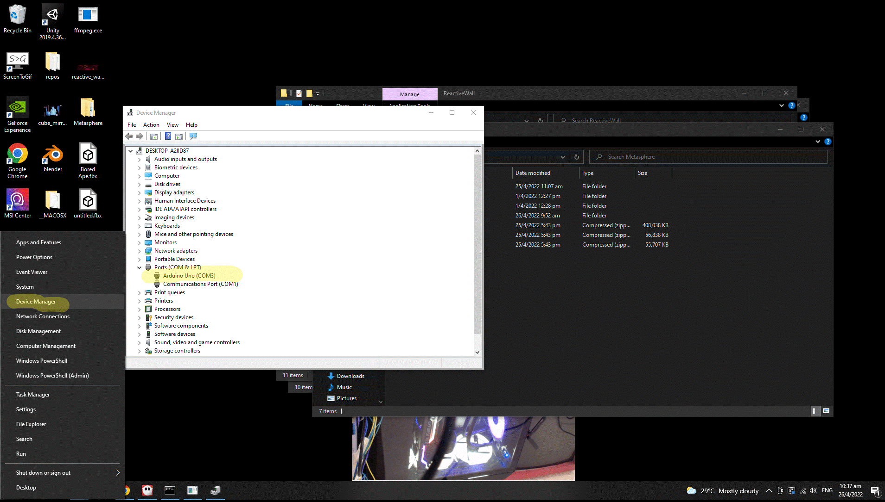

# Metasphere
Setup Instructions for Metajam 2022 Metasphere exhibits

---
## Ape
### How to run
Program should automatically startup. Make sure the Kinect is on and connected before that.

### Possible errors
- Ape appears to be stuck at a weird pose when there is no one. The cause of this may likely be due to a misdetection- something captured by the camera is detected to be a human pose. To fix this, just restart the program.

---
## Cube Mirror
### How to run
Program should automatically startup. Make sure the Realsense connected to a USB 3.0 port (blue colored) before that.

---
## Metasphere Reactive
### How to run
2 programs should automatically run on startup. The first is a camera server and the other is the application itself. Make sure the USB camera and Arduino are connected before that.

### Recalibrating camera position and lighting
Close the camera server application if it's running. Run 'camera_test.bat' from Desktop. Adjust the camera and lighting until all templates can be properly recognized.

### Possible errors
- Camera server fails to startup.  
Normally, the camera server will wait for the Unity application before checking the camera. If the program ends by itself, try running 'camera_test.bat'. Should it shutsdown by itself again, this may be due to the camera not properly detected. This may be due to spoilt camera or unplugging and plugging in of more usb cameras. If it's the latter case, you can try to change the cam_src in the script to another number like 1 or 0.  
  
  **How to edit camera script**  
  Recommended: Some familiarity with coding. The path to the python script can be found in the bat file using a text editor from the Startup folder (See Additional troubleshooting). 

- 'Loading configuration' does not disappear. Unplug and plug back the arduino (sensor) usb to the pc. Then in the game, press L on keyboard to reset connection until you see the sensor values.

- 'Failed to connect to Arduino'. Follow the instructions and check the Arduino port in the txt file. Check the Arduino port by right-click windows icon -> Device manager -> Ports

In this image the port is COM3. Change the port in the txt file to reflect this as well.

- One side of the projection is black. Unplug and replug the hdmis and the usb c on the mini recorders of the mapping computer.

- The Unity app only runs on one side of the screen, while the other remains at Desktop. Restart the computer. Otherwise see [here](/Multiscreen Setup.md).

---
## Additional troubleshooting
- None of the programs autostart at all / How to setup autostart. In case of a fresh installation or if the exe files were moved around, follow these steps:
1.  Go to where the exe file is located in the file system.
2.  Right click and create a shortcut of the exe.
3.  Press Windows key + R.
4.  Type Shell:startup and enter.
5.  Add/Replace the shortcuts in the startup folder.  
** for Metasphere Reactive, an additional bat file is required to launch the camera server 

